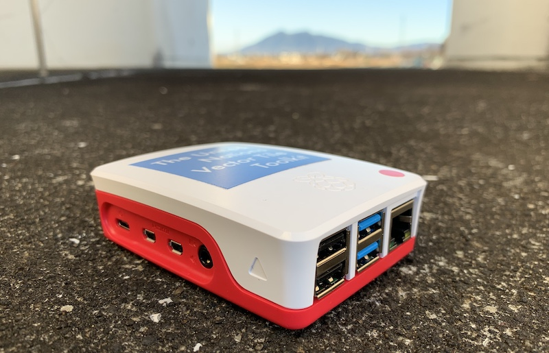
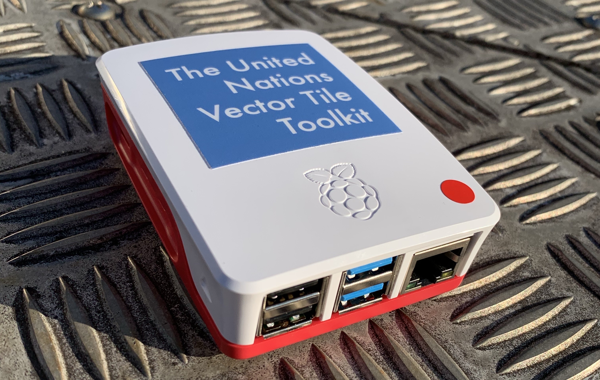

# tsukuba: UNVT Portal Ledger

This is a ledger of Misoras (Raspberry Pi with the United Nations Vector Tile Toolkit (UNVT)). We started this ledger since UN-GGIM WG-Disasters Conference 2020 in Tokyo. We started the identification number from 321 following [produce-320](https://github.com/un-vector-tile-toolkit/produce-320).

Number 400 and bigger are open to public. Please send a pull request if you want to add your Misora to this ledger. 

Misora is still a tentative name.

# hostname convention
- We use `raspberrypi.local` when we use the `cross-cable` connection.
- We use `m${number}` as the hostname. The host name for the machine number 343 will be `m343`.

# 321
- Built in GSI
- Raspberry Pi 4
# 322
- Built in GSI
- Raspberry Pi 4
# 323
- Built in GSI
- Raspberry Pi 4
# 324
- Built in GSI
- Raspberry Pi 4
- 2020-02-28/: Used by Information Access Division, Geospatial Information Authority of Japan
# 325
- Built in GSI
- Raspberry Pi 4
- 2020-04-22/: Used by International Affairs Division, Geospatial Information Authority of Japan
# 326
- Built in GSI
- Raspberry Pi 4
# 327
- Built in GSI
- Raspberry Pi 4
# 328
- Built in GSI
- Raspberry Pi 4
# 329
- Built in GSI
- Raspberry Pi 4
# 330
- Built in GSI
- Raspberry Pi 4
# 331
- Built in GSI
- Raspberry Pi 4
# 332
- Built in GSI
- Raspberry Pi 4
# 333
- Built in GSI
- Raspberry Pi 4
# 334
- Built in GSI
- Raspberry Pi 4
# 335
- Built in GSI
- Raspberry Pi 4
# 336
- Built in GSI
- Raspberry Pi 4
# 337
- Built in GSI
- Raspberry Pi 4
# 338
- Built in GSI
- Raspberry Pi 4
# 339
- Built in GSI
- Raspberry Pi 4
- 2020-02-25/: Used by Khaled Mashfiq, UNITAR-UNOSAT
# 340
- Built in GSI
- Raspberry Pi 4
- 2020-02-28/: Used by Information Access Division, Geospatial Information Authority of Japan
# 341
- Built in GSI
- Raspberry Pi 4
# 342
- Built in GSI
- Raspberry Pi 4
# 343
- Built in GSI
- Raspberry Pi 4
- 2020-02-15/: Used by Fujimura Hidenori, Lead UN Vector Tile Toolkit
# 344
- Built in GSI
- Raspberry Pi 4
# 345
- Built in GSI
- Raspberry Pi 4
# 346
- Built in GSI
- Raspberry Pi 4
- 2020-02-27/: Used by Nik Dahlia, JUPEM Malaysia
# 347
- Built in GSI
- Raspberry Pi 4
# 348
- Built in GSI
- Raspberry Pi 4
# 349
- Built in GSI
- Raspberry Pi 4
# 350
- Built in GSI
- Raspberry Pi 4
- 2020-02-25/: Used by Verena Kausche, UN ESCAP
# 351
- Built in GSI
- Raspberry Pi 4
# 352
- Built in GSI
- Raspberry Pi 4
# 353
- Built in GSI
- Raspberry Pi 4
- 2020-04-20/: To be used by Survey of Bangladesh (through B.U; TBD)
# 354
- Built in GSI
- Raspberry Pi 4
# 355
- Built in GSI
- Raspberry Pi 4
# 356
- Built in GSI
- Raspberry Pi 4
# 357
- Built in GSI
- Raspberry Pi 4
# 358
- Built in GSI
- Raspberry Pi 4
# 359
- Built in GSI
- Raspberry Pi 4
# 360
- Built in GSI
- Raspberry Pi 4
# 361
- [yata](https://github.com/unvt/yata) 1
- Raspberry Pi 4
# 362
- [yata](https://github.com/unvt/yata) 2
- Raspberry Pi 4
# 363
- [yata](https://github.com/unvt/yata) 3
- Raspberry Pi 4

# 400
* at Furuhashi Laboratory, Aoyama Gakuin University
* Raspberry Pi 3

# 401
* at Furuhashi Laboratory, Aoyama Gakuin University
* Raspberry Pi 3

# 402
* at Furuhashi Laboratory, Aoyama Gakuin University
* Raspberry Pi 4 model B/2GB

# 403
* at Furuhashi Laboratory, Aoyama Gakuin University
* Raspberry Pi 4 model B/2GB

# 404
* at Furuhashi Laboratory, Aoyama Gakuin University
* Raspberry Pi 4 model B/2GB

# 405
* at Furuhashi Laboratory, Aoyama Gakuin University
* Raspberry Pi 4 model B/2GB

# 406
* at Furuhashi Laboratory, Aoyama Gakuin University
* Raspberry Pi 4 model B/2GB

# 407
* at Furuhashi Laboratory, Aoyama Gakuin University
* Raspberry Pi 4 model B/2GB

# 411
* built in GSI
* Raspberry Pi 400/4GB

# 412
* built in GSI
* Raspberry Pi 400/4GB

# 413
* built in GSI
* Raspberry Pi 400/4GB

# 700
* built in a JICA project, to be used in ASIG, Albania
* Raspberry Pi 4 model B/4GB

# 701
* built in a JICA project, to be used in ASIG, Albania
* Raspberry Pi 4 model B/4GB

# 702
* built in a JICA project, to be used in ASIG, Albania
* Raspberry Pi 4 model B/4GB

# 703
* built in a JICA project, to be used in ASIG, Albania
* Raspberry Pi 4 model B/4GB

# 704
* built in a JICA project, to be used in ASIG, Albania
* Raspberry Pi 4 model B/4GB

# 705
* built in a JICA project, to be used in ASIG, Albania
* Raspberry Pi 4 model B/4GB

# 706
* built in a JICA project, to be used in ASIG, Albania
* Raspberry Pi 4 model B/4GB

# 707
* built in a JICA project, to be used in ASIG, Albania
* Raspberry Pi 4 model B/4GB

# 2200 @smellman

# 2201 Karen-san

# 2202 Abdul-san

# 2203 Rakib-san

# 2204 Mihiret-san

# j2205 Aibek-san

# j2206 Ram-san

# 2207 Ashok-san

# 2208 Piya-san

# 2209 Katan-san

# 2210 Chon-san

# 2211 Vili-san

# 2212 Joyce-san

# 2213 @hfu
